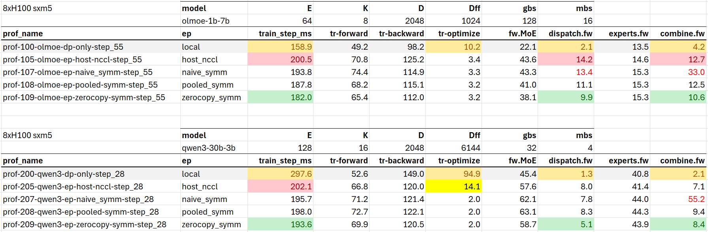
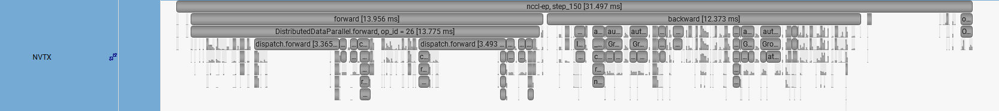
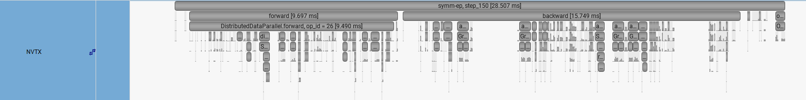

> *Status: Work in progress. Core implementation and early results are available.*

> *Clean codes, more benchmarks, Nsys traces, and documentation are coming.*

## Expert-Parallel (EP) Comm. for MoE Training using Pytorch Symmetry Memory

* Specific to MoE Distributed Training
* Differentiable (Autograded) Dispatch and Combine with PyTorch Symmetric Memory.
* Multiple implementations including optimized versions featuring memory-pool reuse and zero-copy paths.
* Benchmarked against host-initiated EP (NCCL), 
* with Nsys profiling visualizations.

> 


## Introduction

GPU-initiated communication is increasingly adopted in deep learning, especially in expert-parallel MoE inference and training.

In standard host-initiated communication, the NCCL collectives**, GPU-to-GPU data exchange is designed to launch from the CPU. The CPU enqueues the collective operations, while the GPU executes the communication kernels and performs the actual data movement.

In contrast, device(gpu)-initiated communication lets GPU kernels directly coordinate data movement across gpu ranks. **What does GPU-side communication bring?**

1. **Lower host-side overhead.** Eliminating or reducing CPU synchronization and repeated kernel launches improves efficiency. This is particularly useful for latency-sensitive inference, where every microsecond on the critical path matters for achieving ultra-low latency.
1. **Fine-grained overlap and pipelining between communication and compute**.
   * For MoE, direct communication control at the GPU kernels makes it possible to fuse or overlap MoE kernels across dispatch, expert compute, and combine to achieve a single fully gpu-resident kernel with better gpu resource utilization, e.g. [FlashMoE (NeurIPS'25)][flashmoe-paper]. DeepSeek-v4 has superseded their DeepSeek-v3's DeepEP with a single fused [MegaMoE][deepgemm-megamoe-pr], reporting [up to ~2× speedup][dsv4-paper] against strong non-fused baseline for RL rollouts and agent serving. 

### Brief Backend Concept

Device-side communication uses a different communication model, Shared Memory (SHMEM) access while host-side NCCL collectives follow an MPI-like collective model. In essence, SHMEM exposes a partitioned global address space (PGAS) directly to GPU code. What does this mean? 

Each rank owns a local partition of memory (e.g. tensor), but the same allocation is visible across all participating ranks in a **"symmetric"** way. This shared global view of GPU memory enables a GPU kernel of a rank to **directly access** a remote gpu buffer, read from or write to it, **without** asking the remote rank to explicitly participate. And **without** incurring the host CPU. This is technically called one-sided operation.  

### PyTorch Symmetric Memory

PyTorch exposes this device-side communication model through [**Symmetric Memory**][doc-symmem]. Early implementation used PyTorch's [own][pt-forum-symmem] CUDA-backed symmetric mapping, mainly for intra-node peer access. More recently, PyTorch Symmetric Memory has expanded to build atop [NVSHMEM][nvshmem-doc], NVIDIA's SHMEM library, extending to multi-node/cluster-level, accessing peers on multi-node NVLink and RDMA interconnects.

The key value of is **programmability**. Instead of working directly with low-level NVSHMEM APIs, PyTorch provides symmetric-memory tensors and a small set of primitives that can be used from PyTorch code and custom Triton kernels.

Skimming the [APIs][doc-symmem], they can be roughly grouped into two sets. The first is operator-level functionality for common communication patterns, such as all-reduce, all-to-all etc. The second is lower-level control, such as symmetric tensor allocation, rendezvous, remote buffer access, and synchronization primitives. These lower-level pieces are what allow customization, especially useful with Triton kernels to directly participate in communication. See Meta's open-source [Kraken][kraken-gh] for examples of distributed Triton kernels using PyTorch Symmetric Memory.

> <i>** NCCL introduced device-side communication APIs in <a href="https://arxiv.org/abs/2511.15076">2.28</a>. While recent PyTorch builds may bundle NCCL versions newer than 2.28, at the time writing July'26, these APIs are not exposed as standard high-level PyTorch communication interfaces. In this repo, "NCCL" refers specifically to the host-initiated <code>torch.distributed</code> NCCL path, such as <code>all_to_all_single</code>.</i>

### Focus of this Repo

While Pytorch has made Symmetric Memory accessible through good documentation, and talks ([a][ptcf25-symmmem], [b][ptcf25-api4moe]) in recent Pytorch Conference Oct'25, practical use-case-level codes are still limited. It is not yet obvious how to take the APIs and assimilate them into a real MoE training. 

Our overarching goal is to demonstrate an optimized expert-parallel MoE dispatch/combine implementation using PyTorch Symmetric Memory, and compare it against the standard host-initiated NCCL path. We include:

1. **Multiple EP backends with optimization progression.** We provide MoE token shufflers that wrap EP dispatch and combine, starting with naive Symmetric Memory usage, advancing to memory-pool reuse, and finally exploring a workaround in the combine backward to achieve zero-copy performance. 
1. **Benchmarking against host-NCCL.** We also implement a standard torch.distributed NCCL token shuffler, similar in spirit to Megatron-Core's [`MoEAlltoAllTokenDispatcher`][mcore-a2a-dispatcher], as the baseline for performance comparison across MoE configs of Olmoe and Qwen3. 
1. **Nsys profiling walkthrough.** We include Nsys traces to explain how each optimization affects kernel launches, synchronization, memory movement, and communication behavior. 

> Note: The Symmetric Memory EP backends in this repo improve performance, but the gains are expected to be modest. This implementation mainly reduces host-side overhead and unnecessary copies, while the larger opportunity lies in fine-grained communication-compute overlap. The kernel fusion is outside the scope of this repo and deserves a separate implementation and discussion. This repo is intended to serve as a practical entry point to PyTorch Symmetric Memory for MoE training, as well as a reference and baseline for the fused-kernel we plan to build next. 

## Setup

**System requirement:**

- 8 GPUs to reproduce all results.
- Minimum 2 GPUs; use the `00*` make targets for smaller runs.
- Expert compute uses `F.grouped_mm`, which currently supports up to 16 experts per rank. Exceeding this limit throw: `RuntimeError: Number of experts must be smaller than NUM_TILES16`
- Works on PCIe system, but performance may underperform NVLink system.

**Install**: 
1. install pytorch>=2.11/Nsight tool that works for your system.
2. `git clone <this repo> && cd symmem-ep && make install-dep`

**Docker**: 
* use prebuilt [vuiseng9/symmem-ep][docker-symmem-ep], or build `docker build -t symmem-ep .`

**Run**: 
* Just `make <id>-tab-completion`. Reproduce published results with `make do-bench-prof-analyze-all`

[Available make targets](./Makefile):
```
100-olmoe-dp-only                 200-qwen3-dp-only                 000-dev-dp-only
105-olmoe-ep-host-nccl            205-qwen3-ep-host-nccl            005-dev-ep-host-nccl
107-olmoe-ep-naive_symm           207-qwen3-ep-naive_symm           007-dev-ep-naive-symm
108-olmoe-ep-pooled-symm          208-qwen3-ep-pooled-symm          008-dev-ep-pooled-symm
109-olmoe-ep-zerocopy-symm        209-qwen3-ep-zerocopy-symm        009-dev-ep-zerocopy-symm
bench-100-olmoe-dp-only           bench-200-qwen3-dp-only
bench-105-olmoe-ep-host-nccl      bench-205-qwen3-ep-host-nccl
bench-107-olmoe-ep-naive_symm     bench-207-qwen3-ep-naive_symm
bench-108-olmoe-ep-pooled-symm    bench-208-qwen3-ep-pooled-symm
bench-109-olmoe-ep-zerocopy-symm  bench-209-qwen3-ep-zerocopy-symm
prof-100-olmoe-dp-only            prof-200-qwen3-dp-only
prof-105-olmoe-ep-host-nccl       prof-205-qwen3-ep-host-nccl
prof-107-olmoe-ep-naive_symm      prof-207-qwen3-ep-naive_symm
prof-108-olmoe-ep-pooled-symm     prof-208-qwen3-ep-pooled-symm
prof-109-olmoe-ep-zerocopy-symm   prof-209-qwen3-ep-zerocopy-symm
```

## Results
**Early Results on 8xH100, 1-layer MoE Transformer Layers.**



### Training-step profiles 
*Observe ranges of fwd, bwd, spot dispatch & combine.*

NCCL-EP (dispatch.forward is wide (long) enough to be visible)



SymmMem-EP (dispatch.forward is harder to spot since it is compressed)



References:
* [PyTorch Symmetric Memory: A New Programming Paradigm for Distributed AI - Ke Wen & Chien-Chin Huang][ptcf25-symmmem]
* [PyTorch APIs for High Performance MoE Training and Inference - D. Vega-Myhre; Ke Wen & N. Gimelshein][ptcf25-api4moe]
* [PyTorch Symmetric Memory Documentation][doc-symmem]

[ptcf25-symmmem]: https://www.youtube.com/watch?v=5vfcTjosGLg
[ptcf25-api4moe]: https://www.youtube.com/watch?v=h6LjH6Jkaf0
[pt-forum-symmem]: https://dev-discuss.pytorch.org/t/pytorch-symmetricmemory-harnessing-nvlink-programmability-with-ease/2798
[doc-symmem]: https://docs.pytorch.org/docs/2.12/symmetric_memory.html
[kraken-gh]: https://github.com/meta-pytorch/kraken
[kraken-pr32]: https://github.com/meta-pytorch/kraken/pull/32
[nvshmem-doc]: https://docs.nvidia.com/nvshmem/api/index.html

[nccl-gin-paper]: https://arxiv.org/abs/2511.15076

[flashmoe-paper]: https://arxiv.org/abs/2506.04667
[dsv4-paper]: https://arxiv.org/abs/2606.19348v1

[deepgemm-megamoe-pr]: https://github.com/deepseek-ai/DeepGEMM/pull/304

[mcore-a2a-dispatcher]: https://github.com/NVIDIA/Megatron-LM/blob/main/megatron/core/transformer/moe/token_dispatcher.py#L354

[docker-symmem-ep]: https://hub.docker.com/repository/docker/vuiseng9/symmem-ep/general